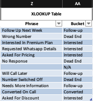
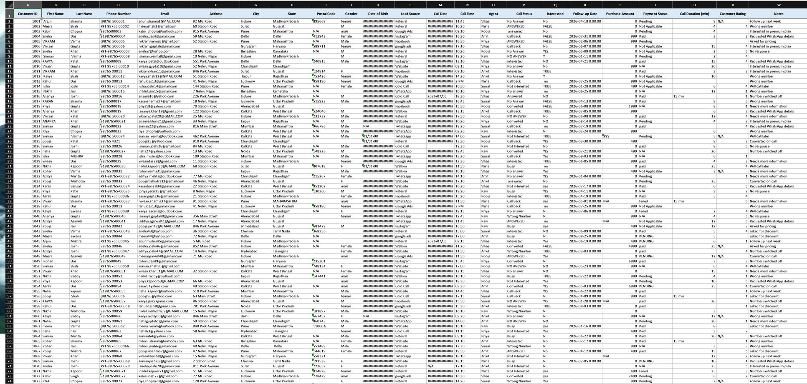
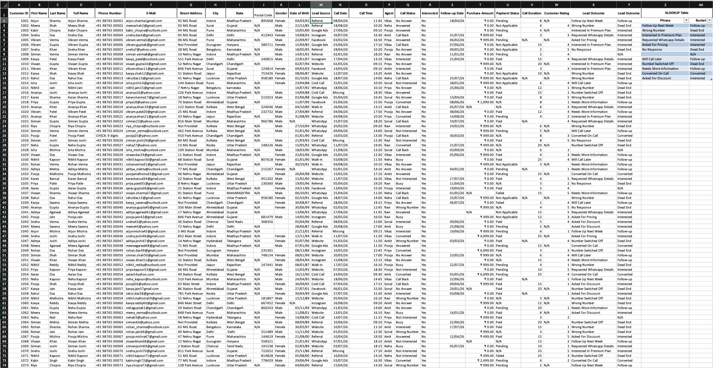

# Cleaning a Customer_Lead_&_Sales_Dataset in Excel

Most tutorials hand you clean data. Real jobs don't. So I built a messy 23-column, 150-row customer Customer_Lead_&_Sales_Dataset on purpose and cleaned it end-to-end in Excel — formulas, validation logic, and the judgment calls a formula can't make for you.

Both the **raw messy sheet** and the **cleaned version** are in this repo. Clone it and try cleaning it yourself, or check my approach below.

## The mess, and how it got fixed

- **Customer IDs** — had duplicates, caught with a COUNTIF flag
- **Names** — inconsistent casing + hidden whitespace (some spaces invisible to the eye)
- **Phone numbers** — 5 different formats (with/without +91, dashes, parentheses); 1 entry was missing a digit entirely and got flagged rather than guessed
- **Street Address** — 22 of 150 rows missing (14.7%); checked for a pattern before labeling vs. dropping
- **Postal Code** — COUNTBLANK showed 43 missing, but that undercounted it — "N/A" text isn't blank to Excel, so a real validation check was needed
- **Gender** — casing/spelling standardized; left the one real blank as a blank, since it's an aggregation field
- **Date of Birth** — flagged an impossible date (Feb 31st) instead of auto-correcting
- **Call Date / Time** — mixed date formats (DD-MM-YYYY vs YYYY/MM/DD) and time formats (12hr vs 24hr); one ambiguous time with no AM/PM flagged for manual check
- **Lead Source** — looked like 10-11 categories, actually 8 — the rest were hidden trailing spaces and case differences ("Website " vs "Website")
- **Interested (Yes/No)** — first attempt using SUBSTITUTE accidentally turned "No" into "Noo" (it matched the letter N inside the word). Fixed with exact-match logic instead
- **Call Duration** — nearly the whole column was numbers stored as text; would have silently broken any SUM/AVERAGE
- **Notes** — looked like free text, was actually ~12 repeating phrases. Built a lookup table + XLOOKUP to bucket them into Converted / Interested / Follow-up / Dead End

That’s 12 columns with issues significant enough to walk through in detail. The remaining columns (City, State, Agent, Call Status, Follow-up Date, Purchase Amount, Payment Status, Customer Rating) had smaller issues of the same kind — stray whitespace, inconsistent casing, occasional blanks — fixed using the same techniques above, just not written up individually since they didn’t introduce anything new.

## Tools used

TRIM, PROPER, SUBSTITUTE (chained), LEN, LEFT/MID/RIGHT, nested IF, IFERROR, ISNUMBER, TEXTJOIN, COUNTIF/COUNTIFS, TEXT, XLOOKUP. No VBA, no add-ins — core Excel formulas only.

## Before / After

## A few decisions worth noting

Flagged unrecoverable errors instead of guessing (the broken phone number, the impossible birthdate). Treated "missing" and "invalid" as different problems, not one bucket. Left numeric blanks as real blanks rather than labeling them, since SUM/AVERAGE already handle those correctly.

## Try it yourself

- Find the duplicate Customer IDs without using Remove Duplicates
- Standardize the 5 phone number formats into one pattern
- Find the impossible Date of Birth — fix it or flag it?
- Is the Notes column really free text, or a disguised category field?
- Redo the whole cleanup in Power Query instead of formulas — which do you prefer?

## About

Built while learning data analytics as a fresher, alongside the Google Data Analytics Professional Certificate and DataCamp's Associate Data Analyst in SQL track. More projects — PivotTables, dashboards, Power BI — coming as this portfolio grows.

## Connect

If you found this useful or have feedback, I'm on LinkedIn https://in.linkedin.com/in/shashank-mishra-58678b375 — always happy to connect with others in data analytics.

---
**Suggested GitHub topics:** `data-cleaning` `excel` `data-analyst-portfolio` `power-query` `xlookup` `data-analytics` `messy-data` `fresher-portfolio`
